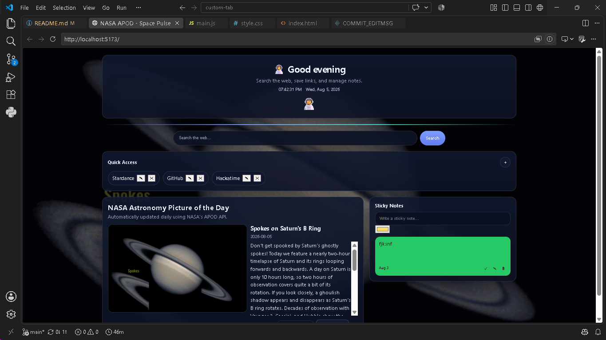
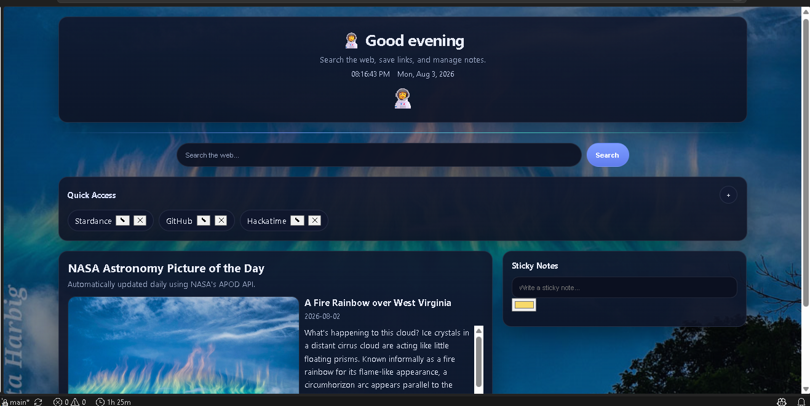
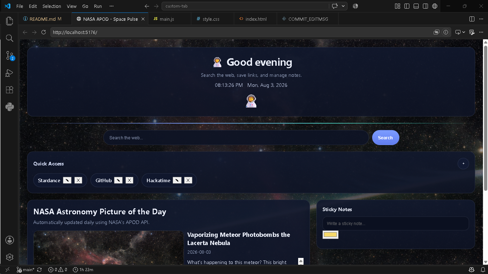

# Space Pulse

Space Pulse is a custom new tab page built with the NASA Astronomy Picture of the Day API. Space Pulse gives a new tab more functionality while being more fun and engaging than a normal new tab. It has a search bar, quick links, sticky notes, and an emoji profile.

## Motivation

I wanted to build this new tab page because I wanted something that was more engaging for a new tab but didn't sacrifice the beauty of a default new tab

## Preview
  

## Features

- NASA APOD

- Search bar

- Quick links

- Sticky notes

- Current time/date and greeting

- Emoji profile

### Search Engines

The search bar can be changed to any search engine by changing the search engine in `main.js`. The default search bar is set to Google but can be changed to other search engines as well. The following are the search engine links below:

| Search Engine | Link |

| Google | `https://www.google.com/search?q=` |

| DuckDuckGo | `https://duckduckgo.com/?q=` |

| Bing | `https://www.bing.com/search?q=` |

| Yahoo | `https://search.yahoo.com/search?p=` |

| Brave Search | `https://search.brave.com/search?q=` |

### NASA APOD (Astronomy Picture of the Day)

The current APOD from NASA is the background for this tab. The APOD can either be an image or a video. If the APOD is a video then a default picture is used for the tab's page.

### Search

The search bar can search any search engine without having to open up another tab.

### Quick Links

The quick links allow the user to type in any links they frequently visit.

### Sticky Notes

The sticky notes allow the user to make, check off, edit, and delete notes.

### Emoji Profile

When first opening up the tab the user gets to choose what emoji they want and it saves the emoji in the browser.

## Technologies Used

- HTML

- CSS

- JavaScript

- Vite

- NASA APOD API

- localStorage

## How To Run

To run the project you need to do the following:

1. Clone the repo

2. Install the dependencies

3. Create a `.env` file in the project root

4. Add your NASA API key to the file

5. Run the dev server

An example of the steps 2-4 would be:

```

npm install

npm run dev

```

For the `.env` file:

```

VITE_NASA_API_KEY=your_api_key_here

```

For the repo structure there is:

```

src/

main.js

style.css

index.html

```

## What I Learned

- API usage

- Local storage

- How to make a new tab page

## What I Want To Add In The Future

- A Pomodoro timer

- More options for sticky notes

- Weather

- Themes

- More options for quick links

## Credits

- NASA for the APOD API

- Hack Club Stardance for the challenge

- My friends for testing out the new tab


## License

This new tab page is open-sourced under the MIT License. Check the `LICENSE` file for more info